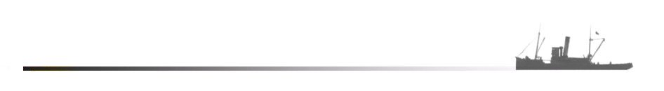

#  SAPUI5 Component Based Development

---

---

The sample code that was used for the presentation can be found in this repository.

### Reference Material

[SAPUI5 Documentation](https://sapui5.hana.ondemand.com/)

- [Routing &amp; Navigation - Enabling Routing in Nested Components](https://sapui5.hana.ondemand.com/#/topic/fb19f501b16e4e4991eb6a017770945b)

- [Routing &amp; Navigation - Working with Multiple Targets](https://sapui5.hana.ondemand.com/#/topic/2c5c84d207d246bc9f733f29df1ff892)

- [sap.ui.core.routing.Router - Method navTo](https://sapui5.hana.ondemand.com/#/api/sap.ui.core.routing.Router%23methods/navTo)

- [sap.ui.core.routing.Router - Event titleChanged](https://sapui5.hana.ondemand.com/#/api/sap.ui.core.routing.Router%23events/titleChanged)

[Download SAPUI5 SDK](https://tools.hana.ondemand.com/#sapui5)

[Sample Application: Routing with nested components](https://sapui5.hana.ondemand.com/#/entity/sap.ui.core.routing.Router/sample/sap.ui.core.sample.RoutingNestedComponent)

## 
